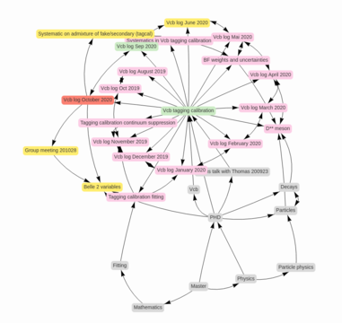

# Verzettler
<!-- ALL-CONTRIBUTORS-BADGE:START - Do not remove or modify this section -->
[](#contributors-)
<!-- ALL-CONTRIBUTORS-BADGE:END -->

**Currently this project is in alpha-beta stage.**
**I'm using it personally on a regular basis, but it's still very experimental.**

## Non-linear, non-hierarchical knowledge management

Knowledge management is about storing information in a way that makes sense to you. The canonical approach is linear and hierarchical in nature: You start with a simple text document. The more information you add, the longer it grows, eventually becoming hard to manage. If your knowledge falls into some disjoint categories, you might have several different documents in different folders, but eventually it will be very hard to figure out the right place for pieces of information as the structure becomes ever more complex.

The Zettelkasten (German for *slipbox*) method is a radical departure from this: Notes are limit to a single thought or information with very high cohesion and rather than imposing a linear or hierarchical structure, these notes are linked together. Pretty much what makes the WWW scale so well ;)

But let me refer you to other people for the big words. I really enjoyed [this article](https://writingcooperative.com/zettelkasten-how-one-german-scholar-was-so-freakishly-productive-997e4e0ca125) about [Niklas Luhman](https://en.wikipedia.org/wiki/Niklas_Luhmann), a German Sociologist of the 20th century who built up an analogue knowledge management system made from thousands of small notes.

## The tools in this repository

This repository contains a selection of different tools to help you manage your own Zettelkasten, which are kept as Markdown files in a way that [Zettlr](https://www.zettlr.com/) understands them.

Among these are

* Tools to make bulk operations on your notes. E.g. to introduce backlinks (a section at the end of each note where all notes that link to the note are linked)
* Tools to convert your notes to other formats.
* A local web server to browse through your notes through your web server. Experimental support to edit your notes directly in your webbrowser was recently implemented as well.
* Tools to analyze the graph structore of your Zettelkasten.

Eventually this project might converge to a browser based tool to fully manage your notes directly from the webbrowser while keeping support for other external editors, but currently it's still bits and pieces.

## Selected features

The webserver shows a smart portion of the graph of neighboring nodes for each note:




## Installation

```sh
pip3 install .
```

Please also make sure that you have the `pandoc` package installed
(not with ``pip`` but with your usual package manager/installer).

### Development installation

Please install the pre-commit hooks

```
pip3 install pre-commit
cd verzettler
pre-commit install
```

## Contributors ✨

Thanks goes to these wonderful people ([emoji key](https://allcontributors.org/docs/en/emoji-key)):

<!-- ALL-CONTRIBUTORS-LIST:START - Do not remove or modify this section -->
<!-- prettier-ignore-start -->
<!-- markdownlint-disable -->
<table>
  <tr>
    <td align="center"><a href="https://github.com/Pablo2m"><br /><sub><b>Pablo2m</b></sub></a><br /><a href="https://github.com/klieret/verzettler/commits?author=Pablo2m" title="Code">💻</a> <a href="https://github.com/klieret/verzettler/issues?q=author%3APablo2m" title="Bug reports">🐛</a> <a href="#ideas-Pablo2m" title="Ideas, Planning, & Feedback">🤔</a></td>
    <td align="center"><a href="https://www.lieret.net"><br /><sub><b>Kilian Lieret</b></sub></a><br /><a href="https://github.com/klieret/verzettler/commits?author=klieret" title="Code">💻</a> <a href="#ideas-klieret" title="Ideas, Planning, & Feedback">🤔</a> <a href="#maintenance-klieret" title="Maintenance">🚧</a> <a href="https://github.com/klieret/verzettler/pulls?q=is%3Apr+reviewed-by%3Aklieret" title="Reviewed Pull Requests">👀</a></td>
  </tr>
</table>

<!-- markdownlint-enable -->
<!-- prettier-ignore-end -->
<!-- ALL-CONTRIBUTORS-LIST:END -->

This project follows the [all-contributors](https://github.com/all-contributors/all-contributors) specification. Contributions of any kind welcome!
